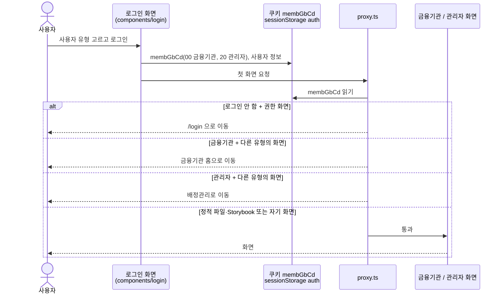
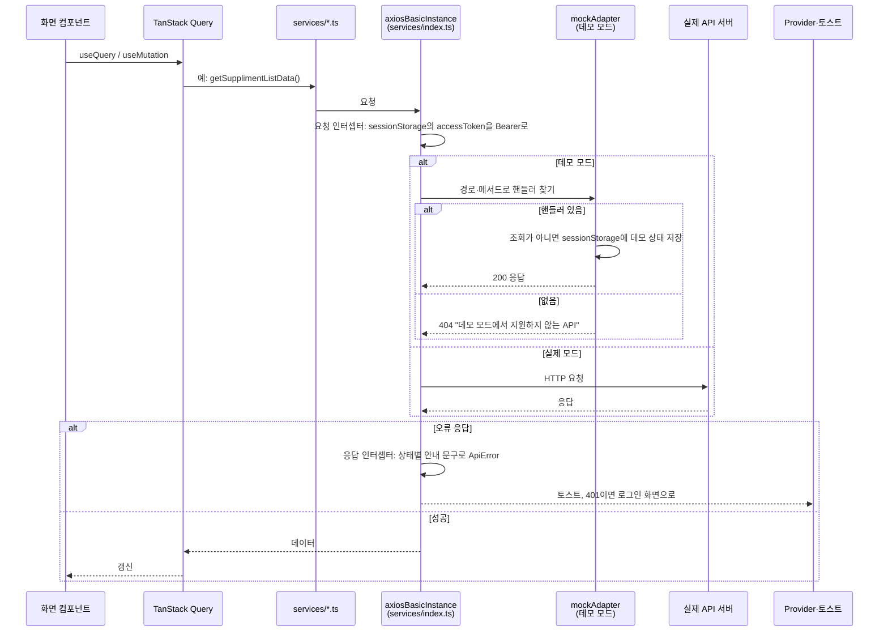
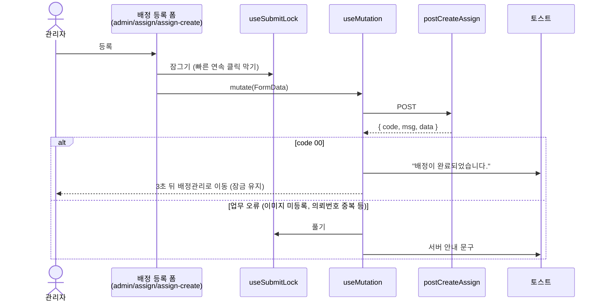

# 시퀀스 다이어그램

cERS의 주요 흐름입니다. 데모 모드(기본값)에서는 실제 서버 대신 목업 어댑터가 응답하지만, 화면 코드는 실제 모드와 같은 길을 지납니다.

## 1. 로그인과 사용자 유형별 화면 이동

```mermaid
sequenceDiagram
    actor 사용자
    participant 로그인 as 로그인 화면<br/>(components/login)
    participant 저장 as 쿠키 membGbCd<br/>sessionStorage auth
    participant 프록시 as proxy.ts
    participant 화면 as 금융기관 / 관리자 화면

    사용자->>로그인: 사용자 유형 고르고 로그인
    로그인->>저장: membGbCd(00 금융기관, 20 관리자), 사용자 정보
    로그인->>프록시: 첫 화면 요청
    프록시->>저장: membGbCd 읽기
    alt 로그인 안 함 + 권한 화면
        프록시-->>사용자: /login 으로 이동
    else 금융기관 + 다른 유형의 화면
        프록시-->>사용자: 금융기관 홈으로 이동
    else 관리자 + 다른 유형의 화면
        프록시-->>사용자: 배정관리로 이동
    else 정적 파일·Storybook 또는 자기 화면
        프록시->>화면: 통과
        화면-->>사용자: 화면
    end
```

## 2. API 요청 경로

```mermaid
sequenceDiagram
    participant 화면 as 화면 컴포넌트
    participant 쿼리 as TanStack Query
    participant 서비스 as services/*.ts
    participant axios as axiosBasicInstance<br/>(services/index.ts)
    participant 목업 as mockAdapter<br/>(데모 모드)
    participant 서버 as 실제 API 서버
    participant 공통 as Provider·토스트

    화면->>쿼리: useQuery / useMutation
    쿼리->>서비스: 예: getSupplimentListData()
    서비스->>axios: 요청
    axios->>axios: 요청 인터셉터: sessionStorage의 accessToken을 Bearer로
    alt 데모 모드
        axios->>목업: 경로·메서드로 핸들러 찾기
        alt 핸들러 있음
            목업->>목업: 조회가 아니면 sessionStorage에 데모 상태 저장
            목업-->>axios: 200 응답
        else 없음
            목업-->>axios: 404 "데모 모드에서 지원하지 않는 API"
        end
    else 실제 모드
        axios->>서버: HTTP 요청
        서버-->>axios: 응답
    end
    alt 오류 응답
        axios->>axios: 응답 인터셉터: 상태별 안내 문구로 ApiError
        axios-->>공통: 토스트, 401이면 로그인 화면으로
    else 성공
        axios-->>쿼리: 데이터
        쿼리-->>화면: 갱신
    end
```

## 3. 관리자 전자등기 배정 등록

```mermaid
sequenceDiagram
    actor 관리자
    participant 폼 as 배정 등록 폼<br/>(admin/assign/assign-create)
    participant 잠금 as useSubmitLock
    participant 변이 as useMutation
    participant 서비스 as postCreateAssign
    participant 토스트

    관리자->>폼: 등록
    폼->>잠금: 잠그기 (빠른 연속 클릭 막기)
    폼->>변이: mutate(FormData)
    변이->>서비스: POST
    서비스-->>변이: { code, msg, data }
    alt code 00
        변이->>토스트: "배정이 완료되었습니다."
        변이-->>관리자: 3초 뒤 배정관리로 이동 (잠금 유지)
    else 업무 오류 (이미지 미등록, 의뢰번호 중복 등)
        변이->>잠금: 풀기
        변이->>토스트: 서버 안내 문구
    end
```
